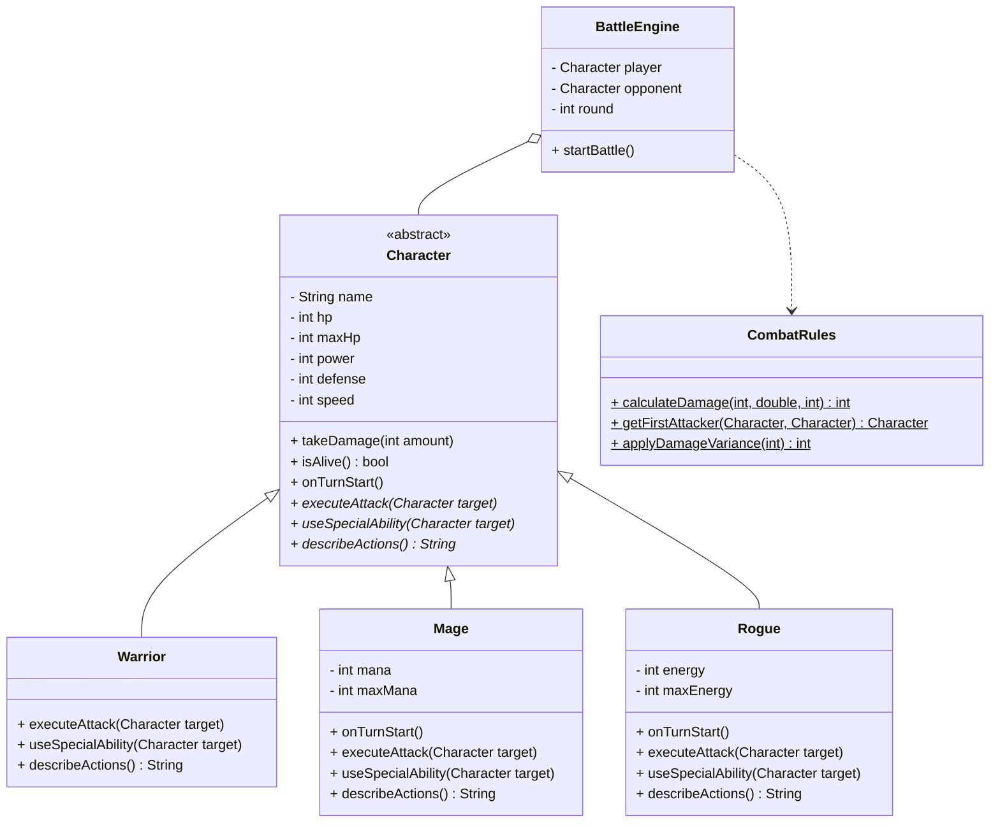

# Java Mini Game Battle

A turn-based, character-driven combat game written in Java, designed to demonstrate the four pillars of Object-Oriented Programming (OOP). Players select a class, customize their hero, and engage in tactical battles against AI-controlled opponents.

## Features

- **Three Character Classes**: Warrior, Mage, and Rogue, each with unique stats, resources, and abilities.
- **Turn-based Combat**: Strategic gameplay where speed, power, and defense determine the outcome.
- **Resource Management**: Manage Mana (Mage) or Energy (Rogue) to execute powerful special abilities.
- **Robust Input Handling**: Validated input to ensure a smooth and crash-free experience.
- **Automated Testing**: Unit tests for core character logic and stat validation.

## Class Diagram



## Concepts Learned

This project implements the four pillars of Object-Oriented Programming:

1.  **Encapsulation**: Used in the `Character` class by making fields `private` and providing `public` getters and setters with validation. This ensures HP, Mana, and Energy are always in a valid state (clamped between 0 and their maximum).
2.  **Abstraction**: The `Character` class is `abstract`, serving as a blueprint. It defines essential behaviors (`executeAttack`, `useSpecialAbility`) that every character must have, without implementing the specifics for each type.
3.  **Inheritance**: `Warrior`, `Mage`, and `Rogue` extend the `Character` class, inheriting common properties like name and health while adding unique resources and behavior.
4.  **Polymorphism**: The `BattleEngine` treats both the player and the opponent as `Character` objects. At runtime, the specific subclass implementation (e.g., `Mage`'s `Fireball` or `Warrior`'s `Power Strike`) is executed automatically.

## Getting Started

### Prerequisites

- **Java 25+**
- **Gradle 9+**

### Setup and Running

1.  **Clone the repository**:
    ```bash
    git clone https://github.com/yourusername/java-game-template.git
    cd java-game-template
    ```

2.  **Build the project**:
    ```bash
    ./gradlew build
    ```

3.  **Run the game**:
    ```bash
    ./gradlew run
    ```

4.  **Run automated tests**:
    ```bash
    ./gradlew test
    ```

## How to Play

1.  **Select Your Class**: Choose from Warrior, Mage, or Rogue.
2.  **Name Your Hero**: Personalize your character.
3.  **Engage in Battle**: Choose between a standard attack or a powerful special ability each turn.
4.  **Manage Resources**: Keep an eye on your HP and your unique class resource (Mana or Energy).
5.  **Defeat Your Opponent**: Reduce the enemy's HP to 0 before they do the same to you!
